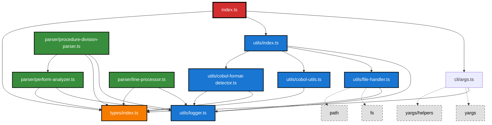

# File Dependency Diagram for TypeScript Source Code

This diagram shows the dependency relationships between TypeScript files in the `src` folder and its subfolders.

## Visual Dependency Diagram

## Dependency Analysis

### 1. Entry Point
- **`index.ts`** - Main entry point
  - Imports from: `cli/args`, `utils/index`, `types/index`
  - Role: Application orchestration and main execution flow

### 2. CLI Module
- **`cli/args.ts`** - Command line argument parsing
  - Imports from: `types/index`, `yargs`, `yargs/helpers`
  - Role: CLI interface and argument validation

### 3. Types Module
- **`types/index.ts`** - Type definitions
  - No internal dependencies (base module)
  - Role: Shared interfaces and type definitions

### 4. Utils Module
- **`utils/index.ts`** - Barrel export for utilities
  - Re-exports: `Logger`, `FileHandler`, `CobolUtils`, `CobolFormatDetector`
  - Role: Unified utils interface

- **`utils/logger.ts`** - Logging utility
  - No internal dependencies
  - Role: Application logging

- **`utils/file-handler.ts`** - File I/O operations
  - Imports from: `utils/logger`, Node.js `fs`, `path`
  - Role: File reading/writing operations

- **`utils/cobol-utils.ts`** - COBOL-specific utilities
  - Imports from: `types/index`
  - Role: COBOL language specific processing

- **`utils/cobol-format-detector.ts`** - Format detection
  - Imports from: `types/index`, `utils/logger`
  - Role: Detecting COBOL format (fixed vs free)

### 5. Parser Module
- **`parser/line-processor.ts`** - Line processing
  - Imports from: `utils/logger`, `types/index`
  - Role: Processing individual COBOL lines

- **`parser/perform-analyzer.ts`** - PERFORM statement analysis
  - Imports from: `utils/logger`, `types/index`
  - Role: Analyzing PERFORM statements and call relationships

- **`parser/procedure-division-parser.ts`** - Procedure division parsing
  - Imports from: `utils/logger`, `types/index`, `parser/perform-analyzer`
  - Role: Parsing PROCEDURE DIVISION structure

## Dependency Layers

The codebase follows a clear layered architecture:

1. **Foundation Layer**: `types/index.ts` (no dependencies)
2. **Utility Layer**: `utils/*` modules (depend on types and logger)
3. **Parser Layer**: `parser/*` modules (depend on types and utils)
4. **CLI Layer**: `cli/args.ts` (depends on types)
5. **Application Layer**: `index.ts` (orchestrates all layers)

## Key Observations

1. **Clean Architecture**: The dependency flow is generally unidirectional, with no circular dependencies
2. **Types as Foundation**: All modules depend on the central types module
3. **Logger Centralization**: Many modules use the centralized logging utility
4. **Parser Composition**: Parser modules build on each other (procedure-division-parser uses perform-analyzer)
5. **Barrel Exports**: Utils uses barrel export pattern for clean imports
6. **External Dependencies**: Limited external dependencies (yargs for CLI, Node.js built-ins for file operations)

## File Relationships Summary

| File | Direct Dependencies | Dependents |
|------|-------------------|------------|
| `types/index.ts` | None | All other modules |
| `utils/logger.ts` | None | file-handler, cobol-format-detector, parsers, index |
| `utils/cobol-utils.ts` | types | utils/index |
| `utils/cobol-format-detector.ts` | types, logger | utils/index |
| `utils/file-handler.ts` | logger, fs, path | utils/index |
| `utils/index.ts` | all utils modules | index |
| `cli/args.ts` | types, yargs | index |
| `parser/line-processor.ts` | logger, types | None directly |
| `parser/perform-analyzer.ts` | logger, types | procedure-division-parser |
| `parser/procedure-division-parser.ts` | logger, types, perform-analyzer | None directly |
| `index.ts` | cli/args, utils, types | None (entry point) |
