# Source Folder Dependencies Diagram

```mermaid
graph TD
    %% Define the folders with better styling
    Root["📁 src (root)"]
    CLI["📁 cli"]
    Parser["📁 parser"] 
    Types["📁 types"]
    Utils["📁 utils"]
    
    %% Dependencies based on import analysis:
    
    %% Root (index.ts) depends on:
    Root --> CLI
    Root --> Utils  
    Root --> Types
    
    %% CLI (args.ts) depends on:
    CLI --> Types
    
    %% Parser files depend on:
    Parser --> Utils
    Parser --> Types
    
    %% Utils files depend on:
    Utils --> Types
    
    %% Types has no dependencies (only exports)
    
    %% Enhanced styling with better colors and contrast
    classDef rootFolder fill:#2196F3,stroke:#1976D2,stroke-width:3px,color:#fff,font-weight:bold
    classDef cliFolder fill:#4CAF50,stroke:#388E3C,stroke-width:2px,color:#fff,font-weight:bold
    classDef parserFolder fill:#FF9800,stroke:#F57C00,stroke-width:2px,color:#fff,font-weight:bold
    classDef typesFolder fill:#9C27B0,stroke:#7B1FA2,stroke-width:2px,color:#fff,font-weight:bold
    classDef utilsFolder fill:#F44336,stroke:#D32F2F,stroke-width:2px,color:#fff,font-weight:bold
    
    %% Apply styles to each folder
    class Root rootFolder
    class CLI cliFolder
    class Parser parserFolder
    class Types typesFolder
    class Utils utilsFolder
```

## Dependency Analysis

Based on the import statements found in the source files:

### Root Level (`src/index.ts`)
- **Depends on**: `cli`, `utils`, `types`
- **Imports**: 
  - `./cli/args` (parseCliArgs, validateCliArgs)
  - `./utils` (Logger, FileHandler) 
  - `./types` (ParseResult)

### CLI Folder (`cli/args.ts`)
- **Depends on**: `types`
- **Imports**:
  - `../types` (CliArgs)

### Parser Folder 
- **Depends on**: `utils`, `types`
- **Imports**:
  - `line-processor.ts`: `../utils/logger`, `../types`
  - `perform-analyzer.ts`: `../utils/logger`, `../types`
  - `procedure-division-parser.ts`: `../utils/logger`, `../types`, `./perform-analyzer`

### Utils Folder
- **Depends on**: `types` (some files)
- **Imports**:
  - `file-handler.ts`: `./logger`
  - `cobol-utils.ts`: `../types`
  - `cobol-format-detector.ts`: `../types`, `./logger`
  - `logger.ts`: No dependencies
  - `index.ts`: Local exports only

### Types Folder
- **Depends on**: None
- **Exports only**: Interface and type definitions

## Dependency Flow
The dependency flow follows a clean layered architecture:
1. **Types** - Base layer with no dependencies
2. **Utils** - Depends only on types  
3. **Parser** - Depends on utils and types
4. **CLI** - Depends only on types
5. **Root** - Orchestrates all layers
